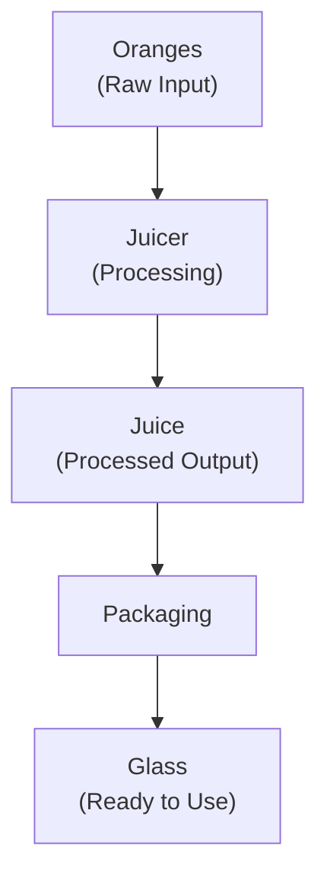
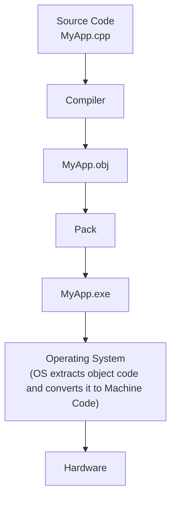
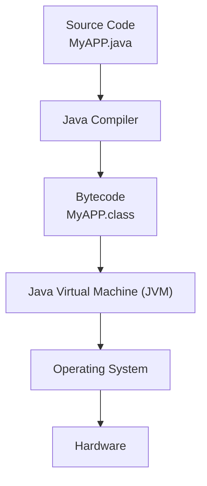
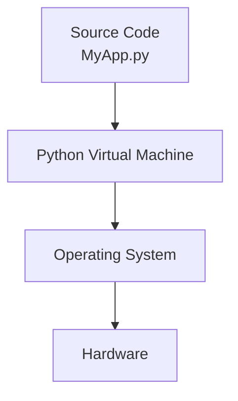
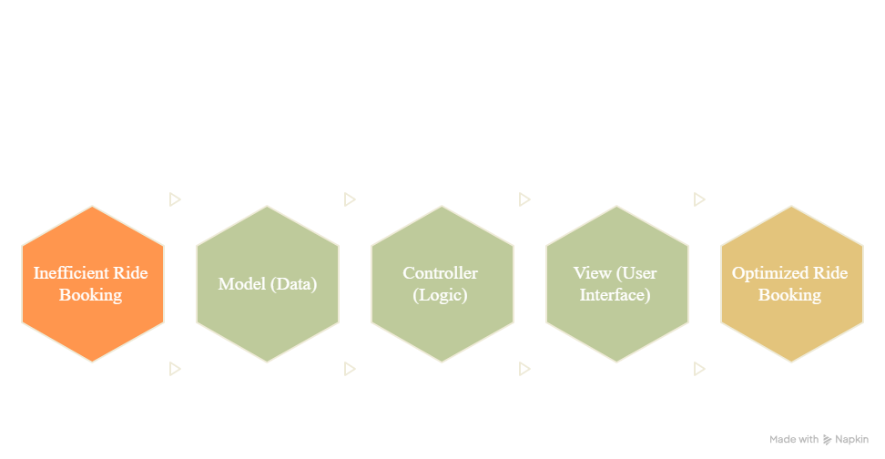
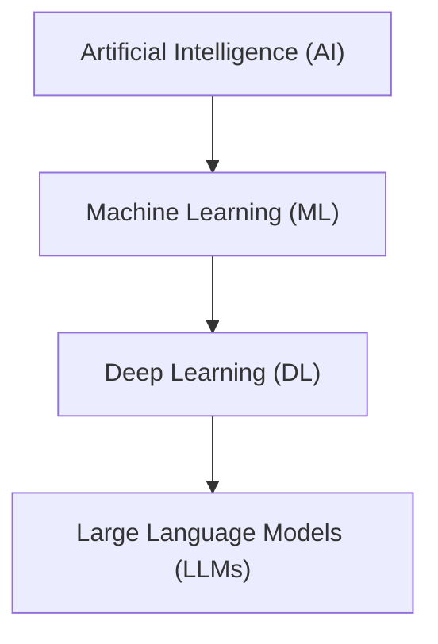

#  Day 01 – Introduction to Agentic AI & Python Fundamentals

## Introduction to Auribises Technologies

The session began with an introduction to **Auribises Technologies** and its software development journey.

### Products Discussed

* **Park Smart (2013)** – Android application
* **Finlo** – Financial technology solution

The company focuses on solving real-world problems through technology and innovation.

---

## Introduction to Python

Python is a **high-level, general-purpose programming language** designed to solve problems efficiently.

Programming is not just writing code—it is the process of understanding a problem and creating logical solutions.

> **Programming = Problem Solving + Logical Thinking**

---

## Problem Solving

Programming is used to solve real-world problems.

Examples include:

* Navigation Systems
* Ride Booking Applications
* Banking Systems
* AI Assistants
* Healthcare Applications

Most software problems can be represented mathematically and solved using algorithms.

---

## Optimization

While designing software, two important factors must be optimized.

### Time Complexity

Measures how quickly a program executes.

Ideal Complexity:

**O(1)** (Constant Time)

Lower time complexity generally results in faster applications.

---

### Space Complexity

Measures the amount of memory consumed by a program.

Efficient software balances both execution speed and memory usage.

---

## Orange Juice Analogy

The trainer explained program execution using the Orange Juice analogy.

**Flow**

This demonstrates how source code is transformed into an executable application.

---

## C Language and Operating System

The trainer explained that **C is often called the "Mother of Many Programming Languages"** because many modern languages are influenced by it.

The Operating System (OS) acts as the bridge between software and computer hardware.

Applications written in different programming languages ultimately communicate with the Operating System.

---

## Interaction of Programming Languages with the Operating System
### C / C++

### Characteristics

* Compiled Language
* Very Fast
* Direct interaction with Operating System
* Used for Operating Systems, Drivers, Embedded Systems and High-performance Applications

---

### Java

### Characteristics

* Platform Independent
* Requires JVM
* "Write Once, Run Anywhere"

---

### Python

### Characteristics

* Interpreted Language
* Easy to Learn
* Preferred for Research Work
* Widely Used in AI, Machine Learning and Automation

---

## MVC Architecture (Model–View–Controller)

MVC is a software architecture pattern that separates an application into three independent components.

This separation improves maintainability, scalability and code organization.

### Model

The Model manages the application's data.

#### Responsibilities

* Store data
* Retrieve data
* Update data

#### Examples

* Source Location
* Destination Location
* User Information
* Vehicle Information

#### Optimization Focus

**Data Structures**

---

### View

The View represents everything visible to the user.

#### Responsibilities

* Display information
* Accept user input

#### Examples

* Mobile Application Screen
* Map Display
* Buttons
* EditTexts
* Images

#### Optimization Focus

**User Experience (UX)**

---

### Controller

The Controller contains the application's business logic.

#### Responsibilities

* Process user requests
* Execute algorithms
* Connect Model and View

#### Examples

* Find Nearest Cab
* Calculate Shortest Route
* Traffic Analysis
* Cab Allocation

#### Optimization Focus

**Algorithms**

---

##  MVC Example – Ride Booking Application

The Ride Booking application is an excellent example of MVC Architecture.

### Model

* Source Location
* Destination Location
* Cab Details

### View

* Login Screen
* Cab details
* Booking Screen
* Map Interface

### Controller

* Find Nearest Driver
* Calculate Shortest Route
* Process Ride Booking
* Update Ride Status

---

## Introduction to Artificial Intelligence

Artificial Intelligence (AI) enables machines to perform tasks that normally require human intelligence.

AI systems are capable of:

* Learning
* Reasoning
* Decision Making
* Problem Solving
* Automation

---

## Evolution of Artificial Intelligence

Artificial Intelligence has evolved through multiple stages.

### Machine Learning (ML)

* Supervised Learning
* Unsupervised Learning

### Deep Learning (DL)

* Convolutional Neural Networks (CNNs)
* Recurrent Neural Networks (RNNs)

### Large Language Models (LLMs)

Large Language Models understand and generate human language and form the foundation of modern AI assistants.

---

